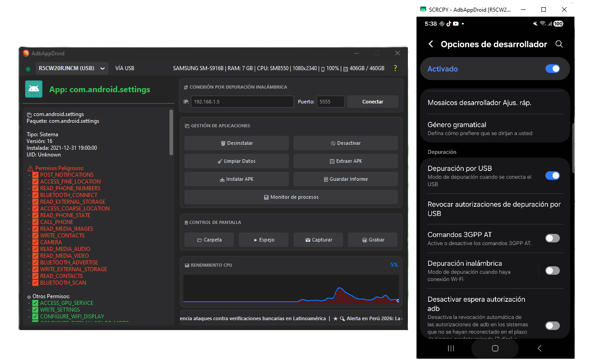

# AdbAppDroid v5.0 📱🚀

[](https://opensource.org/licenses/MIT)


<p align="center">
  
</p>

**AdbAppDroid** Es una potente herramienta portable, diseñada para la gestión de dispositivos Android a través de ADB. Cuenta con una interfaz que ofrece una experiencia fluida y profesional para usuarios entusiastas y avanzados.

---

## ✨ Características Principales

### 📦 Gestión de Aplicaciones
- **Desinstalación Avanzada**: Elimina aplicaciones de usuario y de sistema (con advertencias de seguridad).
- **Control de Estado**: Desactiva (congela) o activa aplicaciones sin desinstalarlas.
- **Limpieza de Datos**: Borra caché y datos de aplicaciones con un solo clic.
- **Extracción de APKs**: Extrae instaladores directamente desde el dispositivo a tu PC.
- **Instalación Rápida**: Instala archivos APK de forma sencilla.

### 📱 Control de Pantalla y Multimedia
- **Espejo (Mirroring)**: Visualiza y controla tu dispositivo en tiempo real con alta calidad (vía `scrcpy`).
- **Capturas de Pantalla**: Toma fotos instantáneas de la pantalla del dispositivo.
- **Grabación de Video**: Graba sesiones en formato MKV con soporte para audio interno (Android 11+).
- **Gestión de Salida**: Selecciona fácilmente la carpeta donde se guardarán tus capturas y videos desde el panel de control.

### 🌐 Conectividad y Monitoreo
- **Depuración Inalámbrica**: Conéctate a tus dispositivos vía WiFi de forma sencilla.
- **Soporte Multi-dispositivo**: Cambia entre múltiples dispositivos conectados simultáneamente desde el selector superior.
- **Gráfico de Rendimiento**: Monitoreo en tiempo real del uso de CPU del dispositivo.
- **Monitor de Procesos**: Visualiza los procesos activos y el consumo de recursos detallado.

---

## 🛠️ Requisitos del Sistema
- **Python 3.10+**
- **Dependencias**: Listadas en `requirements.txt` (CustomTkinter, Pillow, adbutils, etc.)
- **Herramientas Incluidas**: `platform-tools` (ADB) y `scrcpy` ya vienen integradas para una experiencia portable.

---

## 🚀 Instalación y Uso

1. **Clonar el repositorio**:
   ```powershell
   git clone https://github.com/RiderCalcina/AdbAppDroid.git
   cd AdbAppDroid
   ```

2. **Instalar dependencias**:
   ```powershell
   pip install -r requirements.txt
   ```

3. **Ejecutar la aplicación**:
   ```powershell
   python main.py
   ```

---

## 📖 Documentación Detallada

Puedes encontrar guías específicas en la carpeta `docs/`:
- 📘 [Manual de Usuario](docs/MANUAL_USUARIO.md)
- ⚙️ [Instalación y Configuración](docs/INSTALLATION.md)
- 🏗️ [Estructura del Proyecto](docs/STRUCTURE.md)
- 📜 [Historial de Cambios](docs/CHANGELOG.md)

---

## 👤 Créditos y Desarrollador

Desarrollado por **QWERTY-ASERTY**
🌐 [Rider Calcina](https://qwertyaserty.com/)

---
*Nota: Esta herramienta está diseñada para facilitar la administración de dispositivos. Úsela con responsabilidad, especialmente al manipular aplicaciones del sistema.*
