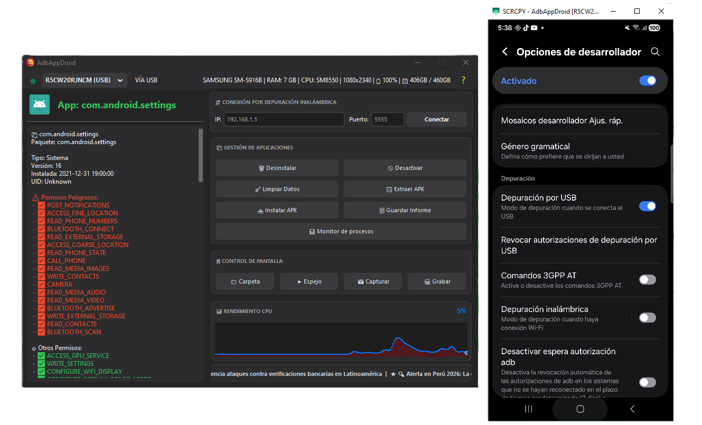

# AdbAppDroid v5.1 📱🚀

[](https://opensource.org/licenses/MIT)


<p align="center">
  
</p>

**AdbAppDroid** es una potente herramienta portable diseñada para la gestión de dispositivos Android a través de ADB. Cuenta con una interfaz moderna y fluida que ofrece una experiencia profesional para usuarios entusiastas y avanzados.

---

## ✨ Características Principales

### 📦 Gestión de Aplicaciones
- **Desinstalación Avanzada**: Elimina aplicaciones de usuario y de sistema de forma limpia (debloat con `pm uninstall -k --user 0`).
- **Control de Estado**: Desactiva (congela) o activa aplicaciones sin borrarlas.
- **Limpieza de Datos**: Borra la caché y datos de usuario con barra de progreso en vivo.
- **Extracción Inteligente**: Descarga apps simples como `.apk` y empaqueta de forma automática aplicaciones divididas (Split APKs / App Bundles) en un archivo `.zip` reinstalable.
- **Instalación Universal**: Soporta archivos `.apk` tradicionales y bundles múltiples (`.zip`, `.xapk`, `.apks`) descomprimiéndolos e instalándolos en bloque.
- **Diagnóstico Integrado**: Detecta automáticamente errores comunes de instalación (como `INSTALL_FAILED_MISSING_SPLIT`) y ofrece sugerencias rápidas de resolución.

### 📱 Control de Pantalla y Multimedia
- **Espejo (Mirroring)**: Visualiza y controla tu dispositivo en tiempo real con alta calidad (vía `scrcpy`) de forma auto-posicionada.
- **Capturas de Pantalla**: Toma fotos instantáneas de la pantalla del dispositivo.
- **Grabación de Video**: Graba sesiones en formato MKV con soporte para audio interno y perfil optimizado para Xiaomi/HyperOS.
- **Gestión de Salida**: Configura la ruta del PC donde se almacenarán las capturas y grabaciones en un clic.

### 🌐 Conectividad y Monitoreo
- **Emparejamiento Inalámbrico**: Realiza el emparejamiento de seguridad con código de 6 dígitos (Android 11+) mediante un diálogo emergente dedicado.
- **Soporte Multi-dispositivo**: Alterna el control instantáneamente entre múltiples dispositivos conectados (USB y Wi-Fi) usando el menú superior.
- **Gráfico de Rendimiento**: Monitoreo dinámico del uso general de CPU (0-100%).
- **Monitor de Procesos**: Listado en tiempo real de tareas, PID, RAM y uso de procesador detallado.

---

## 🛠️ Requisitos del Sistema
- **Python 3.10+**
- **Dependencias**: Listadas en `requirements.txt` (CustomTkinter, Pillow, adbutils, etc.)
- **Herramientas Incluidas**: `platform-tools` (ADB) y `scrcpy` ya vienen integradas para una experiencia portable.

---

## 🚀 Instalación y Uso

1. **Clonar el repositorio**:
   ```powershell
   git clone https://github.com/RiderCalcina/AdbAppDroid.git
   cd AdbAppDroid
   ```

2. **Instalar dependencias**:
   ```powershell
   pip install -r requirements.txt
   ```

3. **Ejecutar la aplicación**:
   ```powershell
   python main.py
   ```

---

## 📖 Documentación Detallada

Puedes encontrar guías específicas en la carpeta `docs/`:
- 📘 [Manual de Usuario](docs/MANUAL_USUARIO.md)
- ⚙️ [Instalación y Configuración](docs/INSTALLATION.md)
- 🏗️ [Estructura del Proyecto](docs/STRUCTURE.md)
- 📜 [Historial de Cambios](docs/CHANGELOG.md)

---

## 👤 Créditos y Desarrollador

Desarrollado por **QWERTY-ASERTY**
🌐 [Rider Calcina](https://qwertyaserty.com/)

---
*Nota: Esta herramienta está diseñada para facilitar la administración de dispositivos. Úsela con responsabilidad, especialmente al manipular aplicaciones del sistema.*
