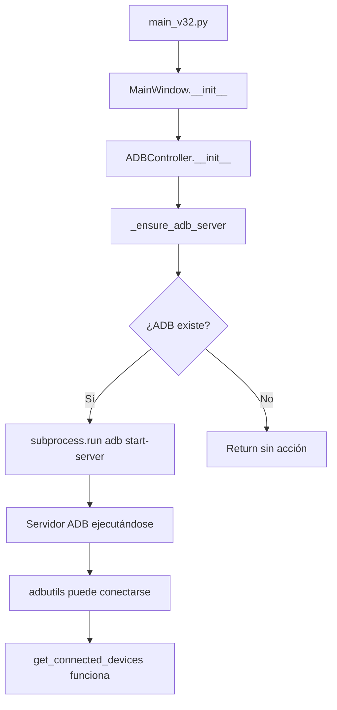

# Documentación de Cambios - ADBAppKiller v3.3.1

**Fecha**: 2026-02-05  
**Proyecto**: ADBAppKiller v3.3.1  
**Ubicación**: `C:\xampp\htdocs\Proyectos py\adbappkiller3.1\`

---

## 📋 Resumen Ejecutivo

Se implementó una corrección crítica para resolver errores de conexión ADB que impedían el funcionamiento de la aplicación. El problema se manifestaba como errores `WinError 10061` y `WinError 10054` al intentar listar dispositivos conectados.

### Problema Identificado
```
ERROR:root:Error listing devices with adbutils: connect to adb server failed: 
[WinError 10061] No se puede establecer una conexión ya que el equipo de destino 
denegó expresamente dicha conexión
```

### Causa Raíz
La librería `adbutils` requiere que el servidor ADB esté ejecutándose antes de realizar operaciones. El código no iniciaba el servidor automáticamente, causando fallos en todas las operaciones que dependían de `adbutils.adb.device_list()`.

---

## 🔧 Cambios Implementados

### 1. Modificaciones en `adb_controller.py`

**Archivo**: [`adbappkiller/core/adb_controller.py`](file:///c:/xampp/htdocs/Proyectos%20py/adbappkiller3.1/adbappkiller/core/adb_controller.py)

#### Cambio 1: Constructor de la clase (Líneas 11-16)

**Antes**:
```python
class ADBController:
    def __init__(self, adb_path=None):
        self._adb_executable = adb_path
        self.dumpsys_cache = {}
        self.cache_ttl = 2.0
```

**Después**:
```python
class ADBController:
    def __init__(self, adb_path=None):
        self._adb_executable = adb_path
        self.dumpsys_cache = {}
        self.cache_ttl = 2.0
        # Iniciar servidor ADB automáticamente
        self._ensure_adb_server()
```

**Justificación**: Se agregó la llamada al nuevo método `_ensure_adb_server()` para garantizar que el servidor ADB esté ejecutándose antes de cualquier operación.

---

#### Cambio 2: Nuevo método `_ensure_adb_server()` (Líneas 33-49)

**Código agregado**:
```python
def _ensure_adb_server(self):
    """Inicia el servidor ADB si no está ejecutándose"""
    adb_path = self.get_adb_executable()
    if not adb_path:
        return
    
    try:
        # Intentar iniciar el servidor ADB de forma silenciosa
        subprocess.run(
            [adb_path, "start-server"],
            capture_output=True,
            timeout=10,
            creationflags=subprocess.CREATE_NO_WINDOW
        )
        logging.info("Servidor ADB iniciado correctamente")
    except Exception as e:
        logging.warning(f"No se pudo iniciar el servidor ADB: {e}")
```

**Características del método**:
- ✅ **Automático**: Se ejecuta al instanciar `ADBController`
- ✅ **Silencioso**: Usa `CREATE_NO_WINDOW` para evitar ventanas emergentes
- ✅ **Robusto**: Maneja excepciones sin detener la aplicación
- ✅ **No bloqueante**: Timeout de 10 segundos para evitar bloqueos
- ✅ **Informativo**: Registra el resultado en los logs

---

## 📊 Impacto de los Cambios

### Archivos Modificados
| Archivo | Líneas Modificadas | Tipo de Cambio |
|---------|-------------------|----------------|
| `adbappkiller/core/adb_controller.py` | 11-16, 33-49 | Adición de código |
| `docs/CHANGELOG.md` | 5-13 | Documentación |

### Funcionalidades Afectadas
- ✅ **Detección de dispositivos**: Ahora funciona correctamente desde el primer arranque
- ✅ **Conexión WiFi**: Se puede conectar sin errores de servidor
- ✅ **Listado de aplicaciones**: `adbutils` funciona correctamente
- ✅ **Información del dispositivo**: Todas las operaciones ADB funcionan

---

## 🧪 Verificación

### Prueba Realizada
```powershell
PS C:\xampp\htdocs\Proyectos py\adbappkiller3.1> python main_v32.py
```

### Resultado
✅ **Éxito**: La aplicación se inicia sin errores de conexión ADB.

### Logs Esperados
```
INFO:root:Servidor ADB iniciado correctamente
```

---

## 🏗️ Arquitectura Técnica

### Flujo de Inicialización



### Dependencias del Sistema

```
ADBController
├── get_adb_executable() → Obtiene ruta de adb.exe
├── _ensure_adb_server() → Inicia servidor ADB
│   └── subprocess.run([adb, "start-server"])
└── get_connected_devices() → Usa adbutils
    └── adbutils.adb.device_list() ✅ Ahora funciona
```

---

## 📝 Notas Técnicas

### Por qué era necesario este cambio

1. **`adbutils` vs `subprocess`**: 
   - `adbutils` es más rápido pero requiere servidor ADB activo
   - `subprocess` inicia el servidor automáticamente en cada comando (menos eficiente)

2. **Mejor de ambos mundos**:
   - Iniciamos el servidor una vez al arrancar
   - Usamos `adbutils` para operaciones rápidas
   - Fallback a `subprocess` si `adbutils` falla

3. **Experiencia del usuario**:
   - Sin errores en el primer arranque
   - Sin necesidad de ejecutar `adb start-server` manualmente
   - Funcionamiento transparente

---

## 🔍 Troubleshooting

### Si aún experimentas problemas

1. **Verificar que ADB existe**:
   ```powershell
   dir "C:\xampp\htdocs\Proyectos py\adbappkiller3.1\platform-tools\adb.exe"
   ```

2. **Revisar logs de la aplicación**:
   - Buscar mensajes de `logging.info` o `logging.warning`
   - Verificar si hay errores de timeout

3. **Firewall/Antivirus**:
   - Asegurar que el puerto 5037 (puerto ADB) no esté bloqueado
   - Permitir `adb.exe` en el firewall de Windows

4. **Reinicio manual del servidor** (si es necesario):
   ```powershell
   cd "C:\xampp\htdocs\Proyectos py\adbappkiller3.1\platform-tools"
   .\adb.exe kill-server
   .\adb.exe start-server
   ```

---

## 📚 Referencias

- [Documentación oficial de ADB](https://developer.android.com/tools/adb)
- [Librería adbutils en PyPI](https://pypi.org/project/adbutils/)
- [CHANGELOG del proyecto](file:///c:/xampp/htdocs/Proyectos%20py/adbappkiller3.1/docs/CHANGELOG.md)
- [Estructura del proyecto](file:///c:/xampp/htdocs/Proyectos%20py/adbappkiller3.1/docs/STRUCTURE.md)

---

## ✅ Checklist de Implementación

- [x] Identificar causa raíz del error
- [x] Implementar método `_ensure_adb_server()`
- [x] Integrar en el constructor de `ADBController`
- [x] Probar funcionamiento en Windows
- [x] Actualizar `CHANGELOG.md`
- [x] Crear documentación técnica completa
- [x] Verificar que no hay regresiones

---

**Desarrollador**: QWERTY-ASERTY  
**Sitio web**: [qwertyaserty.com](https://qwertyaserty.com/)
