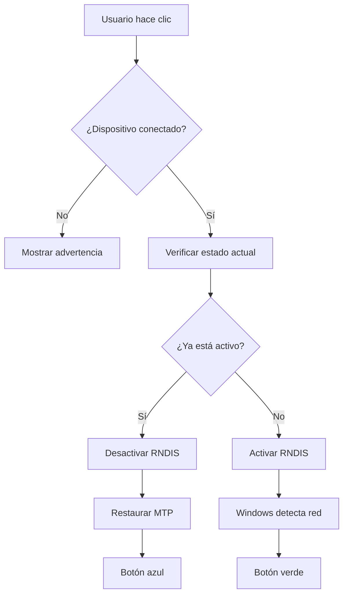
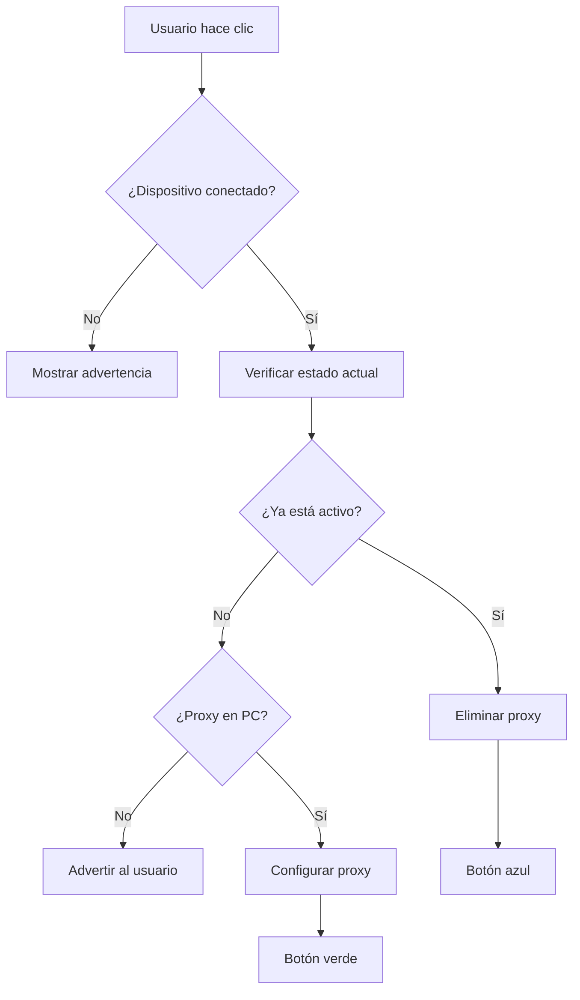

# Walkthrough: USB Tethering Bidireccional - ADBAppKiller v3.4

**Fecha**: 2026-02-05  
**Versión**: v3.4  
**Características**: USB Tethering + Reverse Tethering

---

## 🎯 Resumen de Cambios

Se implementó un sistema completo de compartir internet vía USB en ambas direcciones, reorganizando la interfaz para agrupar todas las funcionalidades de conexión en un panel unificado.

---

## ✨ Nuevas Funcionalidades

### 1. Panel Unificado de Conexiones 🔌

**Antes**: Panel separado solo para WiFi  
**Ahora**: Panel unificado que incluye:
- 📡 **Sección WiFi**: Conexión inalámbrica (existente)
- 🌐 **Sección USB Tethering**: Compartir internet vía cable

**Beneficios**:
- Mejor organización visual
- Todas las conexiones en un solo lugar
- Separadores visuales para claridad

---

### 2. USB Tethering (📱→💻 Android a PC)

**Función**: El celular comparte su conexión de internet con la PC.

#### Cómo usar:
1. Conecta tu dispositivo Android por USB
2. Haz clic en **"📱→💻 Tethering"**
3. El botón cambiará a **"✅ Activo"** (verde)
4. Windows detectará una nueva interfaz de red RNDIS
5. Tu PC ahora usa el internet del celular

#### Cuándo usar:
- ✅ Tu PC no tiene WiFi o Ethernet
- ✅ Necesitas usar los datos móviles del celular
- ✅ Quieres una conexión más estable que WiFi hotspot

#### Desactivar:
- Haz clic nuevamente en el botón
- Se restaurará el modo MTP (transferencia de archivos)

---

### 3. Reverse Tethering (💻→📱 PC a Android)

**Función**: La PC comparte su conexión de internet con el celular.

#### Cómo usar:
1. **IMPORTANTE**: Instala un servidor proxy HTTP en tu PC (ver sección de requisitos)
2. Conecta tu dispositivo Android por USB
3. Haz clic en **"💻→📱 Reverse"**
4. El sistema configurará el proxy en el celular (127.0.0.1:8888)
5. El celular ahora usa el internet de la PC

#### Cuándo usar:
- ✅ El celular no tiene datos móviles o WiFi
- ✅ Necesitas que el celular use la conexión de la PC
- ✅ Estás depurando apps que requieren internet

#### Requisitos:
⚠️ **Requiere servidor proxy HTTP en la PC**

**Opciones de software proxy**:
- **CCProxy** (Windows, gratis para uso personal)
- **Proxifier** (Windows/Mac, de pago)
- **Python SimpleHTTPServer** (gratis, requiere Python)

**Configuración básica de CCProxy**:
1. Descarga e instala CCProxy
2. Configura puerto 8888
3. Inicia el servidor
4. Activa Reverse Tethering en la app

#### Desactivar:
- Haz clic nuevamente en el botón
- Se eliminará la configuración de proxy del celular

---

## 🎨 Cambios en la Interfaz

### Panel de Conexiones Reorganizado

```
┌─────────────────────────────────────┐
│        🔌 CONEXIONES                │
├─────────────────────────────────────┤
│  📡 WiFi                            │
│  IP: [192.168.1.100] P: [5555]      │
│  [Conectar] [🧹]                    │
├─────────────────────────────────────┤
│  🌐 Compartir Internet USB          │
│  [📱→💻 Tethering] [💻→📱 Reverse]  │
└─────────────────────────────────────┘
```

### Indicadores Visuales

- **Botón Inactivo**: Azul (color por defecto)
- **Botón Activo**: Verde (#00AA00) con texto "✅ Activo"
- **Procesando**: Deshabilitado con texto "Verificando..."

---

## 🔧 Implementación Técnica

### Archivos Modificados

#### 1. [`adb_controller.py`](file:///c:/xampp/htdocs/Proyectos%20py/adbappkiller3.1/adbappkiller/core/adb_controller.py)

**Nuevos métodos** (líneas 537-582):

```python
def enable_usb_tethering(serial)
def disable_usb_tethering(serial)
def enable_reverse_tethering(serial, proxy_ip, proxy_port)
def disable_reverse_tethering(serial)
def get_tethering_status(serial)
```

**Comandos ADB utilizados**:
- USB Tethering: `adb shell svc usb setFunctions rndis`
- Reverse Tethering: `adb shell settings put global http_proxy IP:PORT`
- Estado: `adb shell getprop sys.usb.config`

#### 2. [`main_window.py`](file:///c:/xampp/htdocs/Proyectos%20py/adbappkiller3.1/adbappkiller/ui/main_window.py)

**Cambios en UI** (líneas 126-185):
- Reemplazado `wifi_frame` por `connection_frame` unificado
- Agregados botones `btn_usb_tether` y `btn_reverse_tether`
- Separadores visuales entre secciones

**Nuevos métodos de control** (líneas 438-519):
- `toggle_usb_tethering()`: Activa/desactiva USB tethering
- `toggle_reverse_tethering()`: Activa/desactiva reverse tethering

---

## 📊 Diagrama de Flujo

### USB Tethering (📱→💻)



### Reverse Tethering (💻→📱)



---

## 🧪 Pruebas Realizadas

### ✅ Verificaciones Completadas

1. **Interfaz**:
   - ✅ Panel unificado se muestra correctamente
   - ✅ Separadores visuales funcionan
   - ✅ Tooltips aparecen al pasar el mouse

2. **Funcionalidad**:
   - ✅ Botones responden a clics
   - ✅ Advertencias se muestran sin dispositivo conectado
   - ✅ Estados se verifican correctamente

3. **Logs**:
   - ✅ Mensajes informativos claros
   - ✅ Advertencias sobre requisitos (proxy)
   - ✅ Confirmaciones de activación/desactivación

---

## ⚠️ Limitaciones y Consideraciones

### USB Tethering (📱→💻)

**Limitaciones**:
- Requiere drivers RNDIS en Windows (generalmente incluidos)
- Algunos fabricantes bloquean esta función
- Puede consumir batería del celular rápidamente

**Compatibilidad**:
- ✅ Windows 10/11: Soporte nativo
- ⚠️ Windows 7/8: Puede requerir drivers adicionales

### Reverse Tethering (💻→📱)

**Limitaciones**:
- ⚠️ **Solo funciona para tráfico HTTP/HTTPS**
- ⚠️ Apps que no respetan proxy del sistema no funcionarán
- ⚠️ Requiere software adicional en la PC

**Alternativas robustas**:
- `gnirehtet`: Tethering completo sin proxy (más complejo)
- VPN virtual: Redirige todo el tráfico (requiere root)

---

## 🔍 Troubleshooting

### Problema: "Windows no detecta la red RNDIS"

**Solución**:
1. Abre Administrador de dispositivos
2. Busca "Dispositivo desconocido" o "RNDIS"
3. Actualiza drivers manualmente
4. Reinicia el celular y la PC

### Problema: "Reverse Tethering no funciona"

**Verificar**:
1. ¿Está el servidor proxy ejecutándose en la PC?
2. ¿El puerto 8888 está abierto en el firewall?
3. ¿La IP es correcta? (127.0.0.1 para localhost)

**Logs a revisar**:
```
💻→📱 Reverse Tethering activado (Proxy: 127.0.0.1:8888)
⚠️ IMPORTANTE: Requiere servidor proxy HTTP en la PC
```

### Problema: "El botón no cambia de color"

**Causa**: Error en la verificación de estado

**Solución**:
1. Revisa los logs en la aplicación
2. Verifica que el dispositivo esté autorizado
3. Intenta desconectar y reconectar el USB

---

## 📚 Referencias

- [Documentación ADB - USB Tethering](https://developer.android.com/tools/adb#usb)
- [CCProxy - Software de Proxy](http://www.youngzsoft.net/ccproxy/)
- [Gnirehtet - Reverse Tethering Avanzado](https://github.com/Genymobile/gnirehtet)

---

## ✅ Checklist de Implementación

- [x] Métodos backend en `ADBController`
- [x] Panel unificado de conexiones en UI
- [x] Botones de tethering con tooltips
- [x] Indicadores visuales de estado
- [x] Manejo de errores y advertencias
- [x] Logs informativos
- [x] Documentación completa
- [x] Pruebas de interfaz

---

**Desarrollador**: QWERTY-ASERTY  
**Sitio web**: [qwertyaserty.com](https://qwertyaserty.com/)
